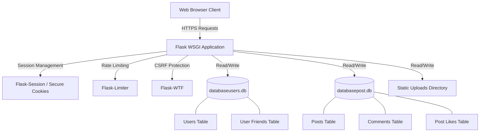

# ChanForum: Technical & Cybersecurity Documentation

ChanForum is a web-based community platform built with Python, Flask, and SQLite. It serves as a digital gathering place for individuals to connect, share their ideas, and find like-minded people. The architecture prioritizes simplicity and robust security, providing a straightforward way for users to broadcast their thoughts through posts and pictures while strictly adhering to modern cybersecurity standards.

---

## Architecture Overview

The system follows a classic monolithic architecture using Flask as the central WSGI application. Data persistence is handled by SQLite, divided into domain-specific databases to isolate user credentials from content.



---

## Technical Specifications

### Technology Stack
- **Backend Framework:** Python 3.x, Flask 3.x
- **WSGI Server:** Gunicorn
- **Database:** SQLite3
- **Frontend:** HTML5, CSS3, Vanilla JavaScript, Jinja2 Templating
- **Security Middleware:** Flask-WTF, Flask-Limiter, Werkzeug Security

### Directory Structure
```text
ChanForum/
├── app.py                  # Main application controller and routing logic
├── database_sqlite.py      # Secure initialization script for database schemas
├── scheme.sql              # SQL schema definition for reference
├── requirements.txt        # Python dependency manifest
├── wsgi.py                 # WSGI entry point for production servers
│
├── db/                     # SQLite database storage directory
│   ├── databasepost.db     # Content database (posts, comments, likes)
│   └── databaseusers.db    # Identity database (users, credentials, friends)
│
├── static/                 # Static assets and user uploads
│   ├── uploads/            # Secure directory for user-uploaded images
│   ├── styles/             # Cascading Style Sheets (CSS)
│   ├── scripts/            # Client-side JavaScript functionality
│   ├── images/             # Static application images
│   └── fonts/              # Custom typography
│
└── templates/              # Jinja2 HTML templates
    ├── base.html           # Master layout containing security headers and navigation
    ├── mainpage.html       # Global post feed and interaction hub
    ├── login.html          # Authentication interface
    ├── register.html       # User registration interface
    └── ...                 # Additional specialized view templates
```

---

## Features & Capabilities

### Identity & Access Management
*   **Authentication:** Secure registration and login workflows using Werkzeug password hashing.
*   **Authorization:** Strict access control preventing unauthenticated users from modifying state or viewing restricted profiles.
*   **Profile Customization:** Users can upload avatars and modify their handles through a validated interface.

### Content Creation & Curation
*   **Rich Media Posts:** Support for text content, titles, descriptions, and image attachments.
*   **Engagement System:** Users can upvote posts (preventing duplicate votes) and participate in comment threads.
*   **Content Lifecycle:** Users retain full control to modify or delete their own posts, with backend validation ensuring they cannot manipulate content owned by others.

### Social Networking
*   **Friend Connections:** Users can establish bidirectional relationships via a dedicated friends management interface.
*   **Discovery:** Clickable author tags on posts lead to profile discovery and connection opportunities.

---

## Cybersecurity Implementation

ChanForum has undergone a rigorous security audit and incorporates comprehensive defensive mechanisms against the OWASP Top 10 vulnerabilities.

### 1. Threat Mitigation Matrix

| Vulnerability Type | Mitigation Strategy | Implementation Details |
| :--- | :--- | :--- |
| **Cross-Site Request Forgery (CSRF)** | Token Validation | `Flask-WTF` enforces CSRF tokens on all state-changing requests (POST/PUT/DELETE). |
| **Cross-Site Scripting (XSS)** | Contextual Output Encoding | Strict Jinja2 escaping. JavaScript variables are passed using the safe `tojson` filter instead of the vulnerable `safe` filter. |
| **Broken Access Control (IDOR)** | Server-side Ownership Checks | Backend verifies session `user_id` against the resource's `user_uniq_id` before allowing edits or deletions. |
| **Unrestricted File Upload** | Strict Validation Pipeline | Enforcement of `MAX_CONTENT_LENGTH` (5MB). Extension whitelisting combined with internal "magic byte" signature verification. Files are renamed using cryptographically secure `UUID4` hashes to prevent Path Traversal. |
| **Brute Force & Spam** | Rate Limiting | `Flask-Limiter` restricts endpoints (e.g., Registration: 3/minute, Login: 5/minute, Comments: 20/hour). |
| **Information Exposure** | Unified Error Handling | Database exceptions are caught and routed to secure `logging` handlers. End-users receive generic 404/500 error pages to prevent schema leakage. |

### 2. Cryptography & Session Security
*   **Password Storage:** Plain-text passwords are never stored. `generate_password_hash` (PBKDF2/scrypt) is used for all credentials.
*   **Session Hardening:** Cookies are configured with `httponly=True`, `secure=True` (in production), and `samesite='Lax'` to prevent XSS session hijacking and CSRF.
*   **Secret Management:** The Flask `SECRET_KEY` is loaded strictly from environment variables (`.env`). The application will refuse to start if the key is hardcoded or missing.
*   **Identifiers:** Internal user routing and linking utilize `UUID4` instead of predictable sequential IDs or SHA-256 hashes of user input.

### 3. HTTP Security Headers
The application utilizes an `@app.after_request` middleware hook to inject defensive HTTP headers on every response:

```http
Content-Security-Policy: default-src 'self'; script-src 'self'; style-src 'self' https://fonts.googleapis.com 'unsafe-inline'; img-src 'self' data:; frame-ancestors 'none';
X-Content-Type-Options: nosniff
X-Frame-Options: DENY
X-XSS-Protection: 1; mode=block
Referrer-Policy: strict-origin-when-cross-origin
Strict-Transport-Security: max-age=31536000; includeSubDomains
```

### 4. Database Integrity
*   **Context Managers:** All SQLite connections are wrapped in `with sqlite3.connect(...)` blocks to guarantee resource release and prevent connection leaks during exceptions.
*   **Initialization Guard:** The `database_sqlite.py` setup script requires explicit terminal confirmation before dropping or recreating schemas to prevent accidental data destruction in production.

---

## Setup & Deployment Guide

### Prerequisites
*   Python 3.10+
*   Git

### Local Installation

1.  **Clone the Repository**
    ```bash
    git clone <repository_url>
    cd ChanForum/ChanForum
    ```

2.  **Environment Configuration**
    Create a `.env` file in the root directory and generate a secure key:
    ```bash
    echo "SECRET_KEY=$(python3 -c 'import secrets; print(secrets.token_hex(32))')" > .env
    echo "FLASK_ENV=development" >> .env
    ```

3.  **Install Dependencies**
    ```bash
    python3 -m venv venv
    source venv/bin/activate
    pip install -r requirements.txt
    ```

4.  **Initialize Database**
    Run the setup script to generate the required SQLite schemas:
    ```bash
    python3 database_sqlite.py
    ```

5.  **Run the Server**
    ```bash
    python3 app.py
    ```
    Access the application at `http://127.0.0.1:5000`.

### Production Deployment
For production environments, do not use the built-in Flask development server. Use a production WSGI server like Gunicorn.

1.  Ensure `.env` contains `FLASK_ENV=production`.
2.  Start Gunicorn:
    ```bash
    gunicorn -w 4 -b 127.0.0.1:5000 wsgi:app
    ```
3.  Configure a reverse proxy (Nginx or Apache) to handle HTTPS termination and serve the `static/` directory directly for optimal performance.
